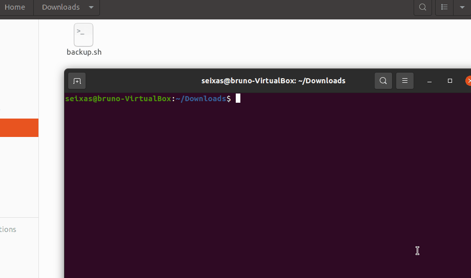
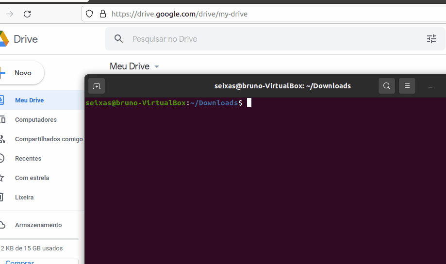
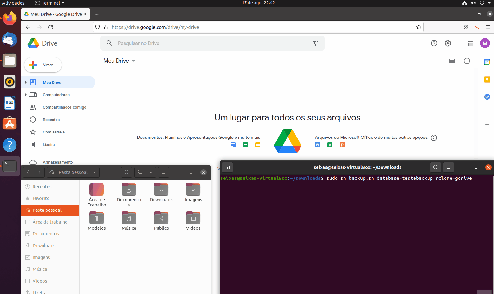

#  🚀 up2date

[](https://travis-ci.org/joemccann/dillinger)

Olá, visitante! Eu sou um ShellScript capaz de realizar seus backups MySQL e mandá-los diretamente para a nuvem em sua conta do Google Drive.

Inicialmente criado para o SGE no [IFNMG - Campus Januária](https://ifnmg.edu.br/januaria), mas adaptado para o uso em qualquer servidor banco MySQL com Ubuntu Server.

# 🗂️ Índice

- 1. [Funcionalidades](#funcionalidades)
- 2. [Requisitos](#requisitos)
- 3. [Instalação](#instalacao)
   - 3.1. [Configurações Iniciais](#confiniciais)
   - 3.2. [Configurando o RClone](#confrclone)
   - 3.3. [Executando o Script](#executandoscript)
   - 3.4. [Programando datas e horários para o backup](#datasehoras)
        -  3.4.1. [Crontab](#crontab)
        -  3.4.2. [Adicionando o script ao Crontab](#addscript)

# <a href="#funcionalidades">⚙️ Funcionalidades</a>

Olha só do que sou capaz:

- ⬇️ Backup do banco de dados MySQL;
- ☁️ Upload do backup no Google Drive;
- 📝 Registro das atividades de backup em um log;
- 📁 Organização dos backups no Google Drive de acordo com sua data de criação:
    Exemplo: No dia 17 de Agosto de 2021 foi criado um backup
    então, esse backup será armazenado em /DATABASE_teste/2021/Aug/teste.sql

# <a href="#requisitos">✔️ Requisitos </a>
- [Banco de Dados MySQL](https://dev.mysql.com/doc/mysql-getting-started/en/)
- [Conta no Google Drive](accounts.google.com/signup/v2/webcreateaccount?hl=en&flowEntry=SignUp)
- Distribuição Linux (de preferência o [Ubuntu/Ubuntu Server](https://ubuntu.com/download))
- Data, horário e fuso horários do servidor devidamente atualizados;
- [Rclone](https://rclone.org/install/)

# <a href="#instalacao">🖥️ Instalação</a>

## <a href="#confiniciais"> 🧠 3.1. Configurações Iniciais </a>
Salve o script em algum diretório seguro (onde não será apagado ou editado por terceiros) e torne-o executável a partir do comando:``
chmod +x backup.sh
``

Agora, vamos executar a configuração do script utilizando o comando:
```bash
sudo sh backup.sh config
```

> É importante executar o script como sudo para que nosso script seja capaz de criar diretórios e arquivos.

Agora, executando o arquivo, dá-se uma tela de configuração inicial onde vamos inserir os dados: 
- Usuário /home (onde serão gerados os diretórios);
- Usuário do banco de dados (credencial de acesso);
- Senha do banco de dados (credencial de acesso);



Com as informações preenchidas, será gerado um arquivo de configurações ``/home/backup.config`` (aqui ficarão os dados de usuário do PC, usuário do banco e senha do banco).

É importante não mover ou alterar esse arquivo e pasta para que o script funcione de maneira correta.

Caso tenha preenchido alguma informação de forma incorreta, basta executar o comando de configurações novamente e repetir os passos acima.


## <a href="#confrclone"> 🌐 3.2. Configurando o Rclone </a>
O backup do banco de dados é enviado ao Google Drive por meio programa cli chamado [Rclone](https://rclone.org). Então, antes de mais nada, vamos criar as configurações do nosso RClone:

```bash
sudo rclone config

No remotes found - make a new one
n) New remote
s) Set configuration password
q) Quit config
n/s/q> n

name> gdrive
Storage> drive
client_id>            #Não preencha
client_secret>        #Não preencha
scope> drive
root_folder_id>       #Não preencha
service_account_file> #Não preencha

Edit advanced config?
y) Yes
n) No (default)
y/n> n

Use auto config?
 # Say Y if not sure
 # Say N if you are working on a remote or headless machine

y) Yes (default)
n) No
y/n> n

Go to this URL, authenticate then paste the code here.

# Acesse o link gerado e faça login em sua conta do Google Drive
Enter a string value. Press Enter for the default ("").
config_verification_code> # Digite o código gerado após o login

Configure this as a Shared Drive (Team Drive)?

y) Yes
n) No (default)
y/n> n

y) Yes this is OK (default)
e) Edit this remote
d) Delete this remote
y/e/d> y

Name                 Type
====                 ====
gdrive               drive

e) Edit existing remote
n) New remote
d) Delete remote
r) Rename remote
c) Copy remote
s) Set configuration password
q) Quit config
e/n/d/r/c/s/q> q
```

As configurações variam de caso a caso, para nosso exemplo, utilizaremos a configuração acima. A instalação é bem tranquila, mas caso tenha problemas, veja [o guia de instalação do Rclone](https://rclone.org/install/).

Com todas as configurações do Rclone realizadas, já podemos verificar se o Google Drive está funcionando em nosso servidor:



## <a href="#executandoscript">✨ 3.3. Executando o Script</a>
Com tudo configurado (tanto o script quanto o Rclone), vamos executar o script com a seguinte sintaxe:
```bash
sudo sh backup.sh database=NOME_DO_BANCO rclone=NOME_DO_RCLONE
```
1 Em ``NOME_DO_BANCO`` vamos inserir o nome do banco de dados que queremos que seja feito o backup.
- Para encontrarmos o nome do banco, basta usarmos o comando ``SHOW DATABASES`` no MySQL cli ou acessar o phpMyAdmin (caso instalado).

2 Em ``NOME_DO_RCLONE`` vamos inserir para qual Google Drive o backup será enviado.
- Encontrar o nome do Rclone é simples, basta executar ``sudo rclone config`` e lá teremos listados todos os nomes dos Rclones criados (em nosso caso, como visto no gif acima, é ``gdrive``).

Em meu caso, vou executar da seguinte maneira:
```bash
sudo sh backup.sh database=testebackup rclone=gdrive
```


## <a href="#datasehoras">⌚ 3.4. Programando datas e horários para o backup</a>
Como vimos acima, o script já está funcionando perfeitamente! Contudo, não é nada produtivo ter que executá-lo todas as vezes em que queremos fazer um backup.

### <a href="#crontab">⏰ 3.4.1. Crontab</a>
Para automatizar o processo, vamos utilizar a ferramenta Crontab que está presente no Linux. Essa ferramenta serve como um agendador de tarefas no sistema operacional do pinguim.

O que vamos fazer é programar para que esse nosso script seja executado em determinadas datas, horários, dias, meses e outras demais opções de tempo.

### <a href="#addscript">⚡ 3.4.2. Adicionando o script ao Crontab</a>
Para acessar o Crontab, abra o Terminal e execute o comando: ``sudo crontab -e``. Utilizando o comando, escolha o editor de texto de sua preferência e adicione o seguinte no final do arquivo:

```bash
# Edit this file to introduce tasks to be run by cron.
#
# Each task to run has to be defined through a single line
# indicating with different fields when the task will be run
# and what command to run for the task
#
# To define the time you can provide concrete values for
# minute (m), hour (h), day of month (dom), month (mon),
# and day of week (dow) or use '*' in these fields (for 'any').
#
# Notice that tasks will be started based on the cron's system
# daemon's notion of time and timezones.
#
# Output of the crontab jobs (including errors) is sent through
# email to the user the crontab file belongs to (unless redirected).
#
# For example, you can run a backup of all your user accounts
# at 5 a.m every week with:
# 0 5 * * 1 tar -zcf /var/backups/home.tgz /home/
#
# For more information see the manual pages of crontab(5) and cron(8)
#
# m h  dom mon dow   command

* 23 * * * sudo sh /home/seixas/Downloads/backup.sh database=testebackup rclone=gdrive
```
A partir de agora, o backup será feito às 23:00 horas todos os dias da semana automaticamente pelo servidor. Caso queira mudar os horários de execução, basta dar uma olhada sobre [como funciona o Crontab](https://www.hostinger.com.br/tutoriais/cron-job-guia).

Se seu servidor possui mais de um banco de dados em funcionando, basta adicioná-lo também nesse arquivo crontab passando seus respectivos parâmetros:
```bash
# Backup do primeiro banco de dados "testebackup" em gdrive
* 23 * * * sudo sh /home/seixas/Downloads/backup.sh database=testebackup rclone=gdrive

# Backup do dp s egimdp banco de dados "sistema" em gdrive
* 23 * * * sudo sh /home/seixas/Downloads/backup.sh database=sistema rclone=gdrive
```

Assim como caso queira que um backup seja redirecionado para outro Google Drive, basta criar uma nova Rclone e adicionar seu nome nos parâmetros do script:

```bash
# Backup do primeiro banco de dados "testebackup" em gdrive
* 23 * * * sudo sh /home/seixas/Downloads/backup.sh database=testebackup rclone=gdrive

# Backup do dp s egimdp banco de dados "sistema" em gdrive
* 23 * * * sudo sh /home/seixas/Downloads/backup.sh database=sistema rclone=gdrive

# Backup do dp s egimdp banco de dados "militar" em gdrive_02
* 23 * * * sudo sh /home/seixas/Downloads/backup.sh database=militar rclone=gdrive_02
```